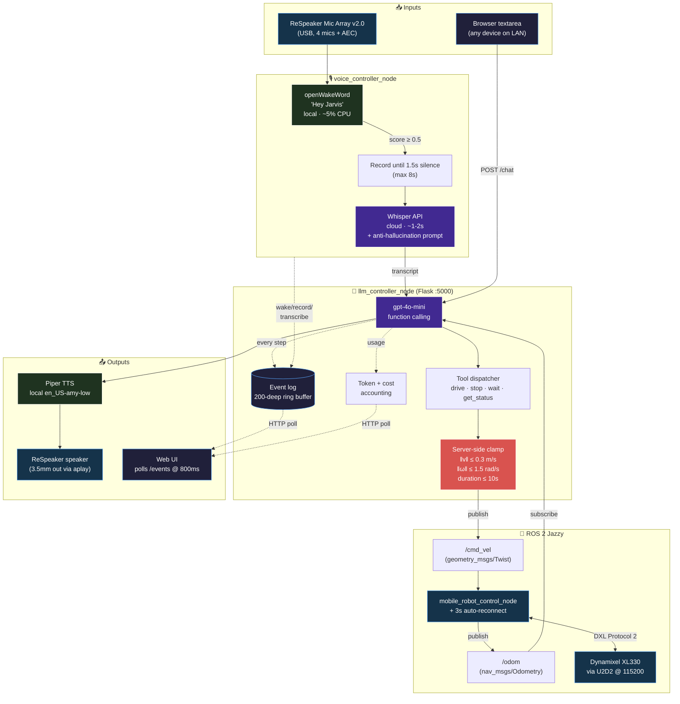
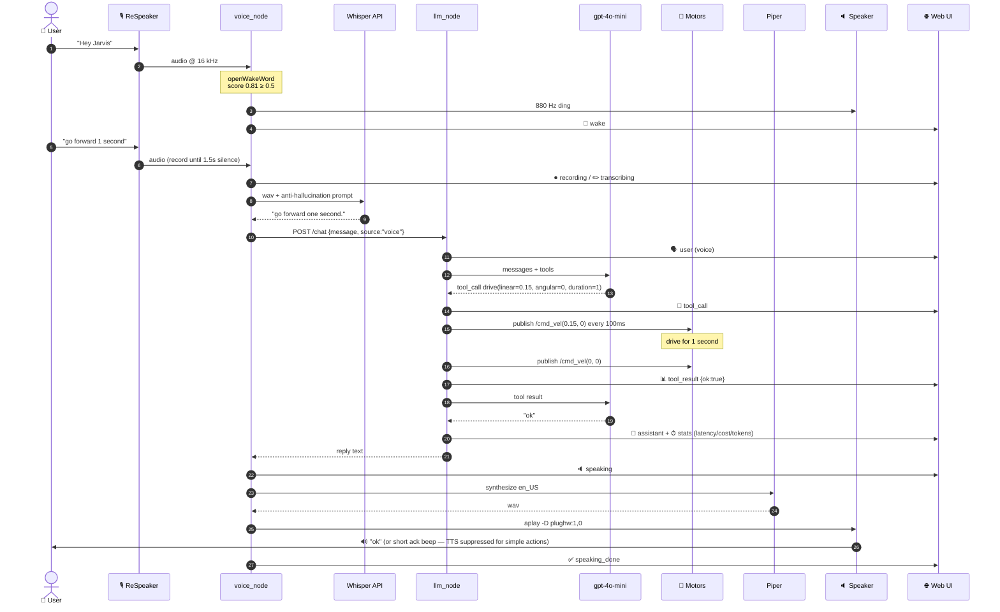

# 🤖 llm_robot_control

> **Talk to your robot. It listens, thinks, and moves.**
>
> A natural-language control layer for the **desktoprobo** HRI platform — wake-word voice + browser chat + real-time event timeline + GPT-4o-mini tool use, all running on a Raspberry Pi 5.

<p align="left">
  
  
  
  
  
</p>

---

## ✨ At a Glance

| | |
|---|---|
| 🎤 **Wake-word voice** | Say *"Hey Jarvis"* + a command in English. Local detection, no cloud. |
| 💬 **Web chat UI** | Open `http://<pi-ip>:5000` from any device on the LAN. |
| 🧠 **LLM tool use** | GPT-4o-mini calls `drive` / `stop` / `wait` / `get_status`. |
| 🔈 **Robot speaks back** | Local Piper English TTS through the ReSpeaker output. |
| 📊 **Live event timeline** | Wake → record → transcribe → reason → tool → reply → speak — all visible. |
| 💰 **Cost dashboard** | Real-time token + USD counter (~$0.0007 / interaction). |
| ⏸ **Pause / resume voice** | Toggle in UI; voice node respects it within 3 s. |
| 💾 **Export sessions** | One-click JSON + Markdown of the full transcript. |
| 🔌 **Power-bank tolerant** | Motors auto-reconnect every 3 s; survives bank idle-shutoff. |
| 🛡️ **Safety bounds** | Server-side velocity / duration clamping that the LLM cannot bypass. |
| 🎮 **Coexists with joystick** | Both publish to `/cmd_vel`; either can take over instantly. |

---

## 🏗 Architecture



**Color legend.** 🟪 = cloud · 🟩 = local model · 🟦 = robot hardware · 🟥 = safety guard · 🟫 = web/UI plumbing.

---

## 🎬 What Happens When You Say "Hey Jarvis, go forward 1 second"



End-to-end latency: **3 – 5 seconds** (network-dominated; Whisper + GPT round-trip).

---

## 🚀 Quick Start

```bash
# 1. Make sure dependencies are in place (one-time)
pip3 install --break-system-packages openai flask python-dotenv \
    sounddevice openwakeword piper-tts numpy soundfile
sudo apt-get install -y portaudio19-dev libportaudio2

# 2. Drop your OpenAI key into ~/desktoprobo/.env
echo 'OPENAI_API_KEY=sk-...' > ~/desktoprobo/.env
chmod 600 ~/desktoprobo/.env

# 3. Build & launch the whole stack
cd ~/desktoprobo
colcon build --packages-select llm_robot_control --symlink-install
source install/setup.bash
ros2 launch llm_robot_control llm_voice_launch.py
```

Open `http://<pi-ip>:5000` in a browser. Say *"Hey Jarvis"* and try **"go forward 1 second"**, **"spin in a circle"**, **"drive a square"**.

---

## 📐 Hardware

| Component | Why it matters |
|---|---|
| **Raspberry Pi 5 (8 GB)** | Ubuntu 24.04 + ROS 2 Jazzy. 4-core ARM is enough for openWakeWord + Piper at the same time. |
| **ReSpeaker Mic Array v2.0** | 4-mic array with on-board AEC + DOA. Drastically reduces false wakes vs a phone mic. |
| **Speaker on ReSpeaker 3.5 mm** | The robot literally speaks back to you. No browser audio needed. |
| **2× Dynamixel XL330-M288-T** | Differential drive at 115200 baud, Protocol 2.0. |
| **Robotis U2D2** | USB→TTL adapter (FTDI FT232H @ `/dev/ttyUSB0`). |
| **Power source** | ⚠️ USB power banks may idle-out → see [Power-bank quirk](#-power-bank-quirk-handled). Wall adapter recommended for studies. |

---

## 🛠 Tech Stack

| Layer | Stack |
|---|---|
| **Wake word** | [openWakeWord](https://github.com/dscripka/openWakeWord) `hey_jarvis_v0.1` (ONNX, local) |
| **STT** | OpenAI **Whisper API** (`whisper-1`, `language="en"`) |
| **LLM** | OpenAI **gpt-4o-mini** with function calling, ≤6 tool rounds per turn |
| **TTS** | [Piper](https://github.com/rhasspy/piper) `en_US-amy-low` (ONNX, local, persistent) |
| **Audio I/O** | `sounddevice` (capture) + `aplay -D plughw:CARD=ArrayUAC10,DEV=0` (playback) |
| **VAD** | `webrtcvad` (mode 2) — ~700 ms end-of-speech detection |
| **Robot driver** | `dynamixel-sdk` Protocol 2.0 |
| **ROS** | ROS 2 Jazzy, `rclpy` (Python) |
| **Web** | Flask + vanilla JS, polls `/events` every 800 ms |
| **Comms inside Pi** | Voice node → LLM node via HTTP loopback (`127.0.0.1:5000`) |

---

## 🎮 Action Repertoire

The LLM has access to four tools. Server-side bounds always win — clamp before publishing.

| Tool | Args | Behavior |
|---|---|---|
| `drive` | `linear` (m/s, ±0.3), `angular` (rad/s, ±1.5), `duration` (s, 0.05–10) | Publish `/cmd_vel` at 10 Hz for `duration` seconds, then auto-stop. |
| `stop` | — | Publish three zero-velocity `/cmd_vel` packets back-to-back. |
| `wait` | `seconds` (0–30) | Sleep without moving — useful for choreographed sequences. |
| `get_status` | — | Return `{x, y, theta_deg}` from the latest `/odom`. |

The system prompt teaches the model: *forward starts at `linear≈0.15` for 1–2 s; a 90° turn takes ≈ 1.57 s at `angular=1.0`*. Calibrate to your robot in `SYSTEM_PROMPT` (top of `llm_controller_node.py`).

---

## 🌐 HTTP API

The Flask server (`llm_controller_node`) exposes everything the UI and voice node need:

| Method | Path | Purpose |
|---|---|---|
| `GET` | `/` | Static web UI (Vue-free vanilla JS) |
| `POST` | `/chat` | `{message, source?}` → run LLM + tool loop, return final reply text |
| `POST` | `/event` | Append a custom event to the live log (used by voice node) |
| `GET` | `/events?since_id=N` | Poll new events since `N`, plus live cost / token / listening_enabled |
| `GET` | `/listening` | Read voice-listening flag |
| `POST` | `/listening` | `{enabled: bool}` — pause / resume voice node |
| `GET` | `/export` | Full session dump: events + chat history + cost stats |
| `POST` | `/reset` | Clear chat history & event log |
| `POST` | `/estop` | Immediate motor stop, bypasses LLM |

---

## 📺 Web UI

**Header pills (left → right):**
- 🟢 **live** — connection status (turns to "offline…" if /events fetch fails)
- 💰 **$0.0007 · 12,345↑/678↓** — cumulative cost & tokens
- 📍 **x / y / θ** — live odometry

**Header buttons:**
- 🎙 **Listening / Paused** — toggle voice listening (voice node polls every 3 s)
- ⬇ **Export** — downloads `robot-log-<timestamp>.json` and `.md`
- 🗑 **Reset** — clear conversation
- ⏹ **STOP** — emergency stop

**Event timeline (auto-scrolling):**

| Style | Kind | When |
|---|---|---|
| Teal · centered | `wake` | Wake word fired |
| Faint gray · centered | `recording` / `transcribing` / `speaking` / `speaking_done` | Voice pipeline status ticks |
| Purple · right-aligned | `user` (voice) | Whisper transcript of your speech |
| Blue · right-aligned | `user` (text) | Browser-typed message |
| Italic gray · left | `thought` | Chain-of-thought from LLM (when it talks alongside calling tools) |
| Amber · centered · mono | `tool_call` | `drive({linear:0.15, ...})` |
| Green · centered · mono | `tool_result` | `{ok:true, ...}` |
| Dark · left | `assistant` | Final LLM reply |
| Dim · centered · mono | `stats` | `Latency 1.4s · Total $0.0008 · tokens 412↑/45↓` |
| Red · centered | `error` | Anything that went wrong |

---

## 🔌 Power-bank quirk, handled

USB power banks shut their output off when current drops below ~50–100 mA for too long. The XL330 idle current is right at the threshold, so power banks will sleep on you between sessions.

**The fix is in `mobile_robot_control_node`:**

1. Single ping at startup (no 30-second blocking wait).
2. A 3-second background `rclpy` timer keeps re-pinging both motor IDs.
3. As soon as a motor responds, torque-off → velocity-mode → torque-on → mark active.
4. If a previously-active motor disappears, it's removed from the active set so the next tick will rediscover it.

Practical effect: **press the power-bank button at any time** (even 10 minutes after launch), and the motors come online within 3 s without restarting any node.

For long-running studies, prefer a wall adapter or a "always-on" power bank (Voltaic / Anker SuperTrickle).

---

## 📦 Detailed Setup

<details>
<summary><b>Whisper anti-hallucination details</b></summary>

When the audio is silent or noise-only, Whisper has a tendency to fall back to its highest-frequency training-set N-grams — most infamously YouTube outro spam ("Thanks for watching, please subscribe…"). This package handles it two ways:

1. **Prompt biasing.** Whisper is given a prompt seeded with the robot's verb vocabulary (forward / backward / stop / turn left / turn right / spin / faster / slower) and `language="en"` is forced, so it strongly prefers those tokens at low confidence.
2. **Substring blacklist.** Transcripts containing known spam fragments are dropped before reaching the LLM. List in `voice_controller_node.py::_WHISPER_HALLUCINATIONS`.

</details>

<details>
<summary><b>Latency timer udev rule (recommended)</b></summary>

The FTDI USB-serial latency timer defaults to 16 ms, which causes intermittent `Incorrect status packet` errors at 115200. Fix it permanently with udev:

```bash
sudo tee /etc/udev/rules.d/99-u2d2.rules > /dev/null <<'EOF'
SUBSYSTEM=="usb-serial", DRIVER=="ftdi_sio", ATTR{latency_timer}="1"
EOF
sudo udevadm control --reload-rules
sudo udevadm trigger
```

After replug, `cat /sys/bus/usb-serial/devices/ttyUSB0/latency_timer` should print `1`.

</details>

<details>
<summary><b>Voice models</b></summary>

```bash
mkdir -p ~/voice_models/piper
cd ~/voice_models/piper
wget https://huggingface.co/rhasspy/piper-voices/resolve/main/en/en_US/amy/low/en_US-amy-low.onnx
wget https://huggingface.co/rhasspy/piper-voices/resolve/main/en/en_US/amy/low/en_US-amy-low.onnx.json
```

openWakeWord ships its pre-trained models inside the pip package — no separate download needed.

</details>

<details>
<summary><b>Run only part of the stack</b></summary>

```bash
# Just the LLM web UI (no voice, no motors)
ros2 run llm_robot_control llm_controller_node

# Voice + LLM but no motors (LLM still publishes /cmd_vel — into the void)
ros2 run llm_robot_control llm_controller_node &
ros2 run llm_robot_control voice_controller_node

# Everything
ros2 launch llm_robot_control llm_voice_launch.py
```

</details>

---

## 🎛 Customization Pointers

<details>
<summary><b>Change the wake word</b></summary>

`openWakeWord` ships with five pretrained models: `alexa`, `hey_jarvis`, `hey_mycroft`, `timer`, `weather`. Edit `HEY_JARVIS_PATH` in `voice_controller_node.py`:

```python
WW_MODEL_PATH = ".../openwakeword/resources/models/alexa_v0.1.onnx"
```

For a custom wake word, train your own with [openWakeWord training notebook](https://github.com/dscripka/openWakeWord/blob/main/notebooks/automatic_model_training.ipynb).

</details>

<details>
<summary><b>Switch to a local LLM (Ollama, Qwen, Phi-4-mini…)</b></summary>

Two-line change in `llm_controller_node.py`:

```python
self.openai = OpenAI(api_key="ollama", base_url="http://localhost:11434/v1")
MODEL = "qwen2.5:3b-instruct"
```

Tool schema and system prompt stay the same. Tool-use reliability drops on 3 B models, especially under noisy transcripts — be extra defensive in `_clamp()`.

</details>

<details>
<summary><b>Add a new action tool</b></summary>

1. Add a JSON schema entry to `TOOLS` in `llm_controller_node.py`.
2. Implement the dispatch branch in `_exec_tool`.
3. Document it in the system prompt.
4. (Optional) Add a kind to the UI's `KIND_META` if you want a custom icon.

Example: a `play_sound` tool that uses Alubeto's `sounds/*.wav` files —

```python
TOOLS.append({
    "type": "function",
    "function": {
        "name": "play_sound",
        "description": "Play a pre-recorded sound. Choices: hello, forward, turn, stop.",
        "parameters": {
            "type": "object",
            "properties": {"name": {"type": "string", "enum": ["hello", "forward", "turn", "stop"]}},
            "required": ["name"],
        },
    },
})
```

</details>

<details>
<summary><b>Tune wake-word sensitivity</b></summary>

Edit `WAKE_THRESHOLD` (default `0.5`) in `voice_controller_node.py`. Higher = fewer false positives, more missed wakes. Score is logged on every wake; check the `wake` events in the UI to see what your environment looks like.

</details>

---

## 🩺 Troubleshooting

<details>
<summary><b>Robot doesn't move but the LLM happily replies</b></summary>

Check `ros2 topic info /cmd_vel`:
- **Subscription count: 0** → `mobile_robot_control_node` is not running. Start it.
- **Motor ID 1/2 not found** → press the power-bank button. The 3-second auto-retry will catch it.
- Motors detected but robot still doesn't move → check torque is enabled (`active_motors` should have 2 entries), and that you're not running two motor nodes at once (port collision on `/dev/ttyUSB0`).

</details>

<details>
<summary><b>Whisper transcribed something completely unrelated</b></summary>

This is the YouTube spam hallucination — see [Whisper anti-hallucination details](#-detailed-setup). Either you spoke too softly, the wake-word triggered on background noise, or the room is genuinely too quiet. Try moving closer to the ReSpeaker.

</details>

<details>
<summary><b>Robot speaks gibberish</b></summary>

Piper is loaded with the English `en_US-amy-low` voice. If the LLM ever replies with non-English content, the synthesizer will fall back to phonemic guessing and may sound off. The current `SYSTEM_PROMPT` instructs the model to reply in English only.

</details>

<details>
<summary><b>Voice node was working, then stopped after I stop/start ROS</b></summary>

Most common: a stale `mobile_robot_control_node` from a previous launch is still holding `/dev/ttyUSB0`. `pkill -9 -f mobile_robot_control_node` then relaunch.

</details>

---

## 🗺 Roadmap

- [ ] **Audio archiving** — save every user wav under `~/desktoprobo/voice_archive/<timestamp>.wav` for HRI study analysis.
- [ ] **Trajectory visualization** — Canvas overlay drawing the path from `/odom`.
- [ ] **Custom wake word** — e.g. train a name like "Hey Robo" with openWakeWord.
- [ ] **Pre-recorded WAV optimization** — for `forward / turn / stop / hello`, play from `sounds/*.wav` instead of TTS for zero latency.
- [ ] **Voice barge-in** — let the user interrupt the robot mid-speech.
- [ ] **Multi-user session separation** — different `session_id` per study participant.
- [ ] **WebSocket / SSE upgrade** — replace 800 ms polling with server push.

---

## 📚 Research Context

This package is part of [`IRL-CT/desktoprobo`](https://github.com/IRL-CT/desktoprobo), an HRI platform from Cornell Tech's Interaction Research Lab (Wendy Ju group). The voice + LLM stack supports a **graduated-autonomy framework** where the robot adapts to user intent over time through multimodal signals.

**Targeted venue:** ICRA 2027 HRI track (Seoul, May 2027).

The web UI's event log doubles as a **transparent reasoning trace**: every wake, transcript, tool call, tool result, and reply is captured with a timestamp, and one click exports the entire interaction as JSON for downstream analysis (Wizard-of-Oz comparisons, accuracy benchmarks, latency studies).

---

## 🙏 Credits

| What | Who |
|---|---|
| Base robot platform | [TiltyBot](https://github.com/imandel/tiltybot) by Ilan Mandel |
| `desktoprobo` workspace, motor driver, sounds | [@Alubeto](https://github.com/Alubeto) (Cornell IRL) |
| Wake-word models | [openWakeWord](https://github.com/dscripka/openWakeWord) by David Scripka |
| Piper TTS | Michael Hansen / [Rhasspy](https://github.com/rhasspy/piper) |
| `llm_robot_control` package (this) | Qingxuan Yang ([@ChangXiang-SCU](https://github.com/ChangXiang-SCU)) |

## 📜 License

MIT for this package; see the top-level repo for the platform's full license.

---

<sub>Built with ☕ on a Raspberry Pi 5 in Cornell Tech, NYC.</sub>
